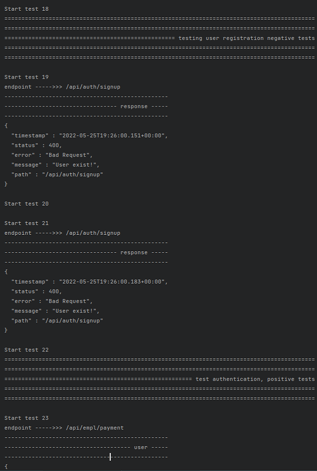
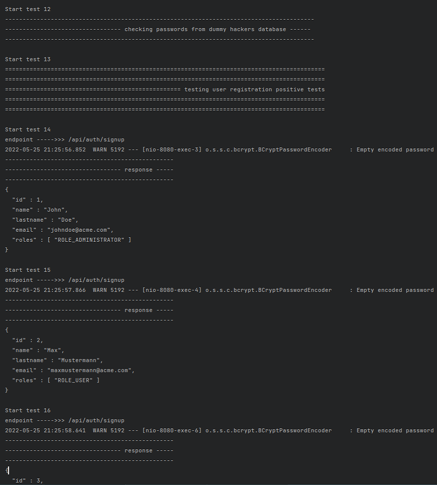
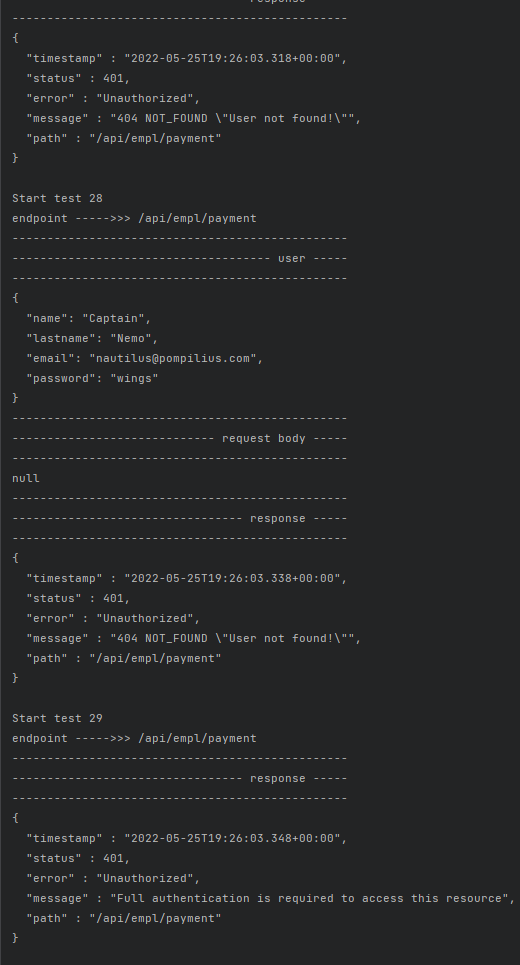
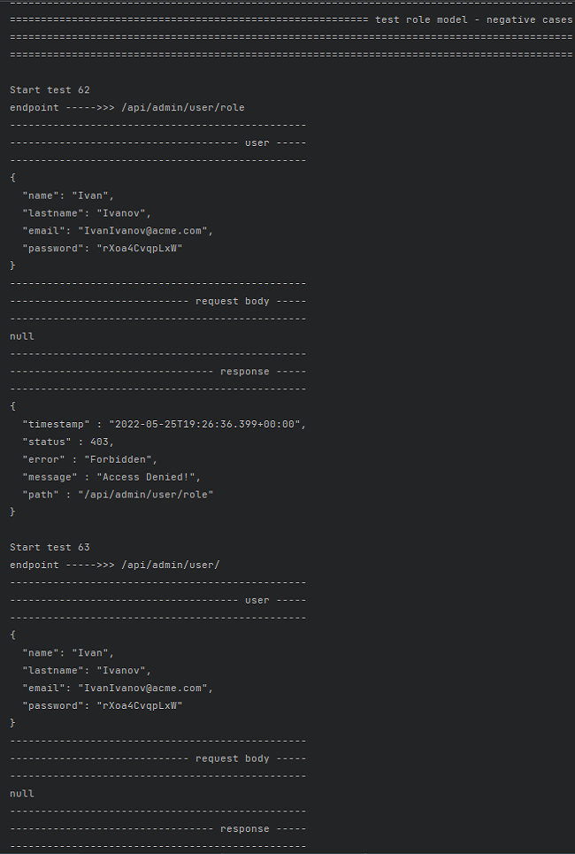
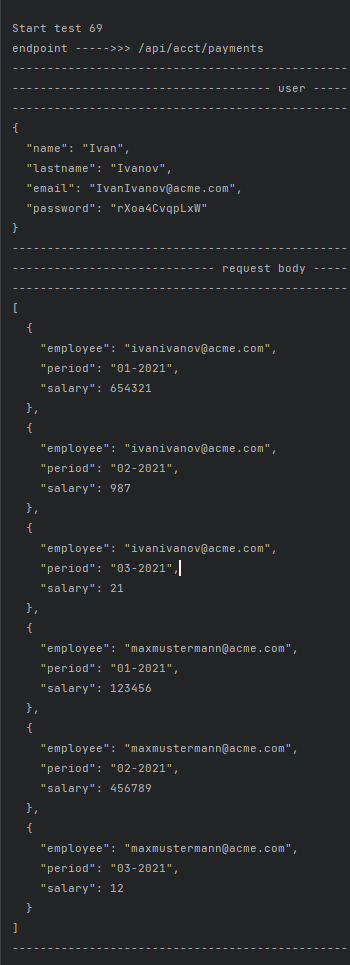
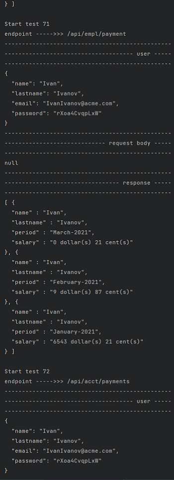
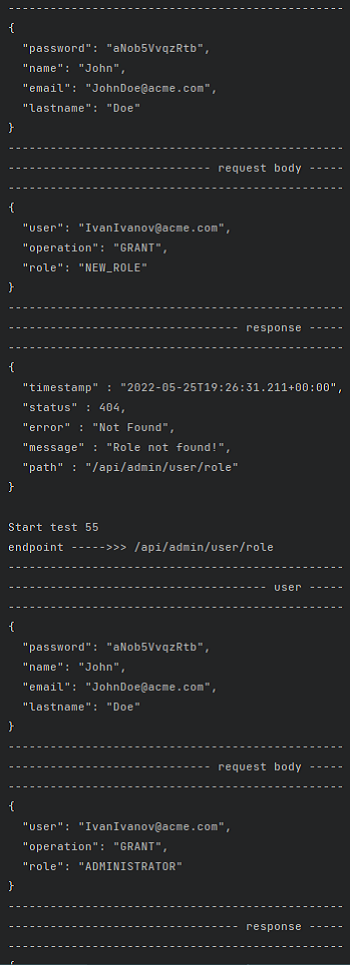
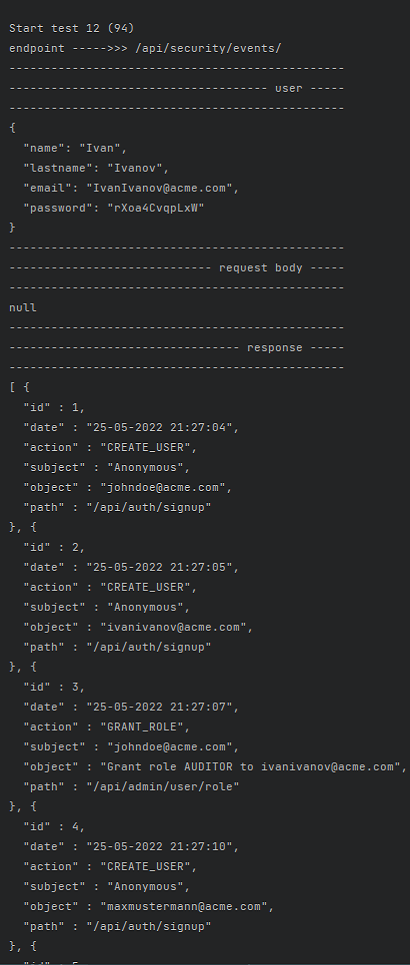
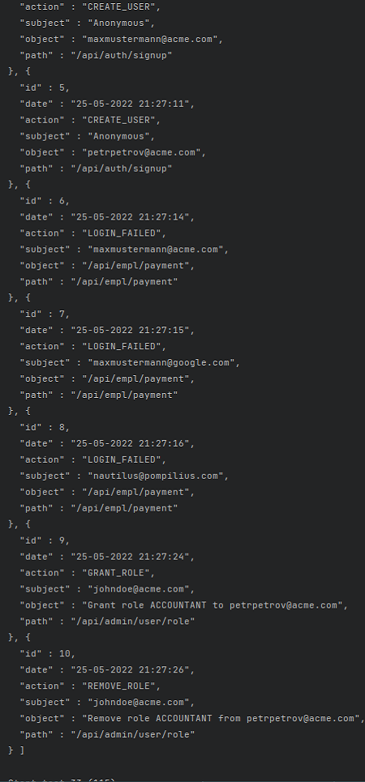

# Account Service
A REST API simulating sending payrolls to the employee's account on the corporate website. Service has a defined role model, business logic is implemented, and security is ensured.

## Table of contents
* [Overview](#overview)
* [Screenshots](#screenshots)
* [Technologies](#technologies)
* [How to start](#how-to-start)

## Overview
A project aimed at familiarizing oneself with the Spring Security module, the basics of user authentication and authorization, logging security-related events and learning about various requirements of modern information security standards for web applications.

## Screenshots
- Some screenshots of various test cases:

  ``loading...``

###### user registration
 

###### user authentication

###### authorization

###### changing password

###### business logic - adding payrolls

###### changing roles

###### deleting user

###### locking user

###### logging security events

## Technologies
- Java 17
- Spring Boot 2.5.3
- Gson 2.9.0
- Gradle 7.2
- H2 Database 1.4
- JUnit 5.7.2
- Hyperskill Testing Library 8.2
- Lombok 1.20

## How to start
You can simply download an archive, unzip it inside the directory you want to, and open it in your IDE.

If you want clone the repo:

- run command line in the directory you want to store the app and type the following command:

``git clone https://github.com/codeofcarbon/account_service``

- or start with Project from Version Control in your IDE by providing the url of this repository.
